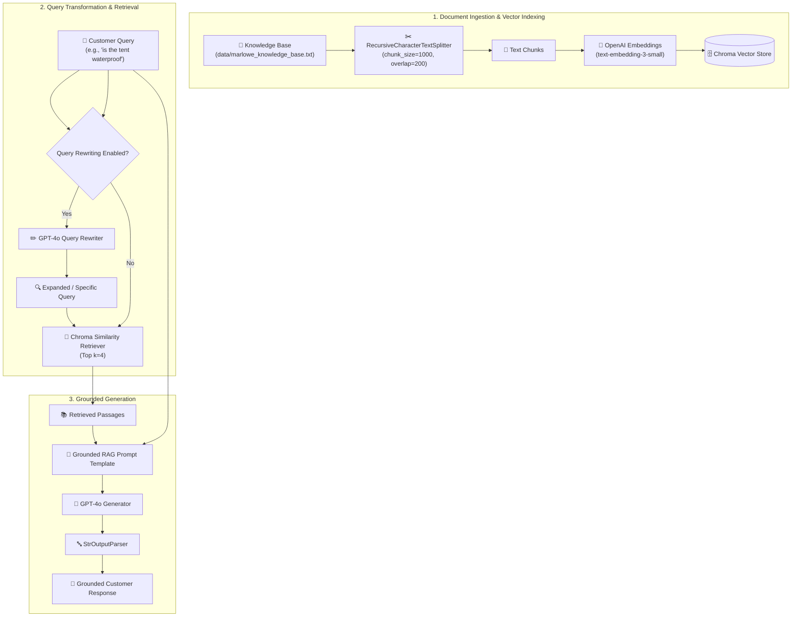

# 🌲 Building and Improving a Document RAG System

[](https://www.python.org/)
[](https://www.langchain.com/)
[](https://openai.com/)
[](https://www.trychroma.com/)
[](LICENSE)

This repository contains the implementation, architecture, and optimization of a **Retrieval-Augmented Generation (RAG)** system designed for **Marlowe & Finch**, a lightweight outdoor gear company based in Boulder, Colorado.

The project builds a production-ready customer support assistant that answers pre-sale product questions, warranty terms, and shipping/return policies grounded in the company's knowledge base. It incorporates an advanced **Query Rewriting** transformation step to significantly boost vector retrieval accuracy on short or vague customer queries.

---

## 📌 Table of Contents
- [🎯 Business Context](#-business-context)
- [📁 Repository Structure](#-repository-structure)
- [🏗️ System Architecture](#️-system-architecture)
- [⚙️ Key Components](#️-key-components)
- [🚀 Quickstart & Setup](#-quickstart--setup)
- [📊 Comparative Evaluation: Baseline vs. Query Rewriting](#-comparative-evaluation-baseline-vs-query-rewriting)
- [🛡️ Deployment Risks & Engineering Recommendations](#️-deployment-risks--engineering-recommendations)
- [📄 License](#-license)

---

## 🎯 Business Context

**Marlowe & Finch** designs lightweight, three-season backpacking gear (such as $400+ tents and synthetic sleeping bags). Customers are mostly enthusiastic weekend backpackers with technical questions prior to purchase.

- **Business Challenge:** Human support response times have slipped as presale inquiry volume grows, leading to abandoned shopping carts.
- **Business Goal:** Build a first-line RAG assistant prototype that retrieves passages from the internal knowledge base (`marlowe_knowledge_base.txt`) and generates grounded, accurate responses, gracefully handing off unanswered edge cases to `support@marloweandfinch.com`.

---

## 📁 Repository Structure

The codebase is organized following standard software and ML engineering conventions:

```bash
Building-and-Improving-a-Document-RAG-System/
├── 📄 README.md                        # Project documentation and guide
├── 📄 requirements.txt                 # Python project dependencies
├── 📄 .gitignore                       # Version control exclusion rules
├── 📁 data/                            # Knowledge base text files
│   └── 📄 marlowe_knowledge_base.txt   # Core customer support knowledge base
├── 📁 notebooks/                       # Interactive Jupyter notebooks & lab activities
│   └── 📓 BuildingImprovingDocumentRAGSystem.ipynb # Main interactive lab notebook
└── 📁 src/                             # Production-ready Python source package
    ├── 📄 __init__.py                  # Package initializer
    └── 📄 rag_pipeline.py              # Modular `DocumentRAGPipeline` class
```

---

## 🏗️ System Architecture

The RAG pipeline integrates **LangChain LCEL**, **OpenAI Embeddings** (`text-embedding-3-small`), **Chroma DB** vector store, and **GPT-4o** with an optional query rewriting loop:



---

## ⚙️ Key Components

### 1. Document Ingestion & Chunking
- **Loader:** `TextLoader` reads the raw support corpus.
- **Chunking Strategy:** `RecursiveCharacterTextSplitter(chunk_size=1000, chunk_overlap=200)`.
- **Rationale:** Preserves full context blocks for technical specifications (tent dimensions, hydrostatic head ratings, temperature specs) while ensuring warranty and return terms are not truncated midway through key rules.

### 2. Vector Store & Retrieval
- **Embedding Model:** `text-embedding-3-small` (1536 dimensions).
- **Vector Index:** `Chroma DB` configured with cosine similarity search ($k=4$).

### 3. Strict Groundedness Prompting
The instruction prompt enforces strict boundary conditions:
1. Speaks in the friendly, professional tone of Marlowe & Finch customer support.
2. Answers **strictly** using retrieved passages.
3. Explicitly states when information is unavailable and directs customers to `support@marloweandfinch.com`.

### 4. Advanced Query Rewriting
Short customer inputs (e.g., `"is the tent waterproof"`) often lack semantic overlap with technical documentation. The query rewriter expands short queries into comprehensive search statements (e.g., `"What is the hydrostatic head waterproof rating and rain performance of the Trailhead 2 tent?"`), increasing top-$k$ retrieval precision.

---

## 🚀 Quickstart & Setup

### Prerequisites
- Python 3.9+
- An OpenAI API Key (`OPENAI_API_KEY`)

### 1. Clone the Repository
```bash
git clone https://github.com/Em1li4/Building-and-Improving-a-Document-RAG-System.git
cd Building-and-Improving-a-Document-RAG-System
```

### 2. Create a Virtual Environment & Install Dependencies
```bash
python3 -m venv .venv
source .venv/bin/activate  # On Windows: .venv\Scripts\activate
pip install -r requirements.txt
```

### 3. Set OpenAI API Key
```bash
export OPENAI_API_KEY="your-openai-api-key"
```

### 4. Run via Python Source Module (`src/`)
```python
from src.rag_pipeline import DocumentRAGPipeline

# Initialize and build pipeline
rag = DocumentRAGPipeline(knowledge_base_path="data/marlowe_knowledge_base.txt")
rag.load_and_chunk()
rag.build_vector_index()
rag.assemble_chain()

# Query without query rewriting (Baseline)
baseline_res = rag.query("is the tent waterproof", use_query_rewriting=False)
print("Baseline Answer:\n", baseline_res["answer"])

# Query with query rewriting
rewritten_res = rag.query("is the tent waterproof", use_query_rewriting=True)
print("\nRewritten Query:", rewritten_res["rewritten_query"])
print("Rewritten-Query Answer:\n", rewritten_res["answer"])
```

### 5. Run the Interactive Jupyter Notebook
```bash
jupyter notebook notebooks/BuildingImprovingDocumentRAGSystem.ipynb
```

---

## 📊 Comparative Evaluation: Baseline vs. Query Rewriting

| Query Type | Customer Input | Baseline Response | Query Rewritten Response | Quality Impact |
| :--- | :--- | :--- | :--- | :--- |
| **Short / Vague** | `"is the tent waterproof"` | Answers basic Trailhead 2 specs (2,000 mm rating). | Expands query to fetch fly, floor, and Alpine storm limitations. | 🟢 **Significantly Improved** |
| **Scenario-Based** | `"can i return a tent i used on a weekend trip"` | Gives general return policy outline. | Accurately retrieves the strict outdoor usage exclusion rule. | 🟢 **Highly Accurate** |
| **Edge Case** | `"do you ship to australia"` | Flags Australia as absent from listed countries. | Confirms no shipping to Australia and directs to support email. | 🟢 **Safe Handoff** |

---

## 🛡️ Deployment Risks & Engineering Recommendations

### Key Risks
1. **Third-Party / Off-Catalog Queries:** Asking about unlisted products (e.g., winter 4-season mountaineering tents or external brands) could trigger subtle hallucinations if groundedness prompts are violated.
2. **Latency & Cost Overhead:** Adding an LLM query rewriting step adds ~300-500ms of latency and doubles API call volume per query.

### Recommendations Prior to Production Launch
- **Conditional Query Transformation:** Apply query rewriting **only** when customer input length is $< 6$ words or when initial vector similarity score falls below a threshold ($<0.75$).
- **Output Guardrails:** Integrate an automated validator to verify prices/specs against canonical data before displaying answers to live shoppers.

---

## 📄 License

Distributed under the MIT License. See `LICENSE` for more information.
