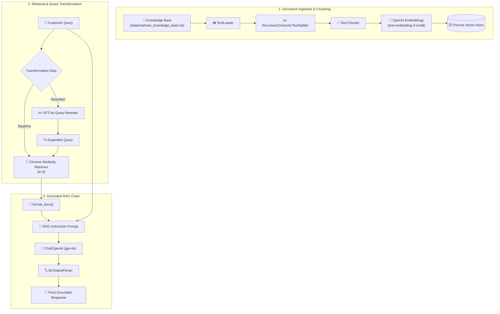

# 🌲 Building and Improving a Document RAG System

[](https://www.python.org/)
[](https://www.langchain.com/)
[](https://openai.com/)
[](https://www.trychroma.com/)
[](LICENSE)

This repository contains the full code, structure, and evaluation framework for **Lab 8: Building and Improving a Document RAG System**.

The project models a scenario as a Machine Learning Engineer (MLE) at **Marlowe & Finch**, a lightweight outdoor gear company based in Boulder, Colorado. The goal is to prototype, evaluate, and improve a Retrieval-Augmented Generation (RAG) assistant using LangChain, OpenAI embeddings, Chroma vector store, and a query rewriting transformation step.

---

## 📌 Table of Contents
- [🎯 Business Context & Objectives](#-business-context--objectives)
- [📁 Repository Structure](#-repository-structure)
- [🏗️ System Architecture](#️-system-architecture)
- [⚙️ Pipeline Implementation & Lab Workflow](#️-pipeline-implementation--lab-workflow)
- [🧪 Evaluation Queries](#-evaluation-queries)
- [🚀 Quickstart & Setup](#-quickstart--setup)
- [📄 License](#-license)

---

## 🎯 Business Context & Objectives

**Marlowe & Finch** sells lightweight three-season backpacking gear (such as tents, sleeping bags, and backpacks). Customer support agents currently handle presale and policy questions manually from an internal knowledge base.

- **Challenge:** Response times are slipping as presale question volume grows, leading to abandoned shopping carts.
- **Objective:** Prototype a grounded RAG assistant that retrieves relevant passages from the internal corpus (`marlowe_knowledge_base.txt`) and answers customer questions accurately.
- **Key Requirement:** Groundedness. The model must stick strictly to retrieved context, avoid hallucinating unlisted policies, and fall back to `support@marloweandfinch.com` when information is not present.

---

## 📁 Repository Structure

```bash
Building-and-Improving-a-Document-RAG-System/
├── 📄 README.md                        # Documentation and lab guide
├── 📄 requirements.txt                 # Python dependencies
├── 📄 .gitignore                       # Version control exclusions
├── 📁 data/                            # Source knowledge base
│   └── 📄 marlowe_knowledge_base.txt   # Company product catalog, warranty, and policies
├── 📁 notebooks/                       # Interactive lab environment
│   └── 📓 BuildingImprovingDocumentRAGSystem.ipynb # Lab notebook
└── 📁 src/                             # Modular Python package
    ├── 📄 __init__.py                  # Package init
    └── 📄 rag_pipeline.py              # DocumentRAGPipeline implementation class
```

---

## 🏗️ System Architecture



---

## ⚙️ Pipeline Implementation & Lab Workflow

### Part 1: Load and Chunk the Knowledge Base
- Uses `TextLoader` to load `data/marlowe_knowledge_base.txt`.
- Splits the document using `RecursiveCharacterTextSplitter` to isolate product specs, warranty terms, and FAQs without fragmenting policy paragraphs.

### Part 2: Build the Vector Index
- Generates embeddings via `text-embedding-3-small`.
- Stores vectors in a `Chroma` vector store and creates a similarity retriever with $k=4$.

### Part 3: Grounded Instruction Prompt Engineering
- Configures system instructions ensuring answers rely **only** on retrieved context.
- Requires explicit fallback to `support@marloweandfinch.com` when context is insufficient.

### Part 4: Assemble & Test Baseline RAG Chain
- Chains retriever, prompt, LLM (`gpt-4o`), and output parser using LangChain Expression Language (LCEL).

### Part 5: Add Query Rewriting
- Implements a query expansion step using GPT-4o to rewrite short or underspecified queries before sending them to the vector retriever.

### Part 6 & 7: Analysis & Reflection
- Evaluates behavior, trade-offs (cost/latency of query rewriting), deployment risks, and AI tool usage.

---

## 🧪 Evaluation Queries

The pipeline is tested against three specific customer queries designed to evaluate different retrieval challenges:

1. **Short / Underspecified Query:**  
   `"is the tent waterproof"`  
   *Tests vector retrieval performance on vague keywords vs. technical specs.*

2. **Scenario & Policy Edge Case:**  
   `"can i return a tent i used on a weekend trip"`  
   *Tests retrieval of the strict "unused / no outdoor signs" return policy rule vs. general return terms.*

3. **Missing Knowledge Base Information:**  
   `"do you ship to australia"`  
   *Tests whether the model adheres to groundedness guidelines and correctly falls back to support email when a destination is unlisted.*

---

## 🚀 Quickstart & Setup

### Prerequisites
- Python 3.9+
- OpenAI API Key (`OPENAI_API_KEY`)

### 1. Installation
```bash
git clone https://github.com/Em1li4/Building-and-Improving-a-Document-RAG-System.git
cd Building-and-Improving-a-Document-RAG-System
pip install -r requirements.txt
```

### 2. Set API Key
```bash
export OPENAI_API_KEY="your-openai-api-key"
```

### 3. Execution Options

**Option A: Run Python Module (`src/`)**
```python
from src.rag_pipeline import DocumentRAGPipeline

pipeline = DocumentRAGPipeline()
pipeline.load_and_chunk()
pipeline.build_vector_index()
pipeline.assemble_chain()

# Execute baseline query
response = pipeline.query("is the tent waterproof", use_query_rewriting=False)
print(response["answer"])
```

**Option B: Run Notebook**
```bash
jupyter notebook notebooks/BuildingImprovingDocumentRAGSystem.ipynb
```

---

## 📄 License

Distributed under the MIT License.
